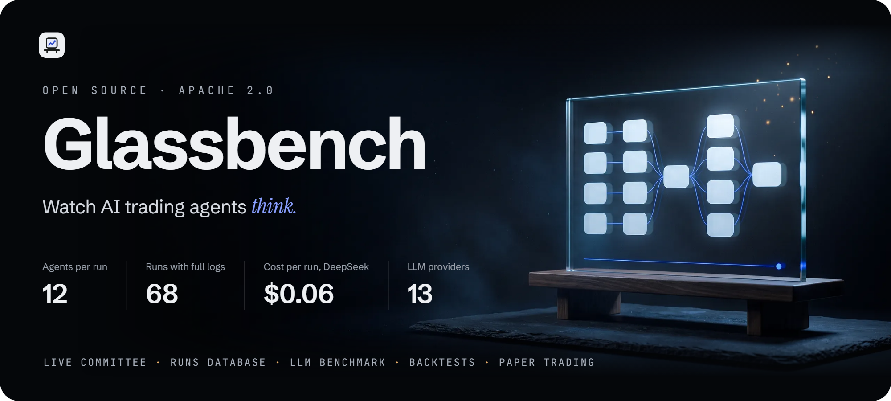
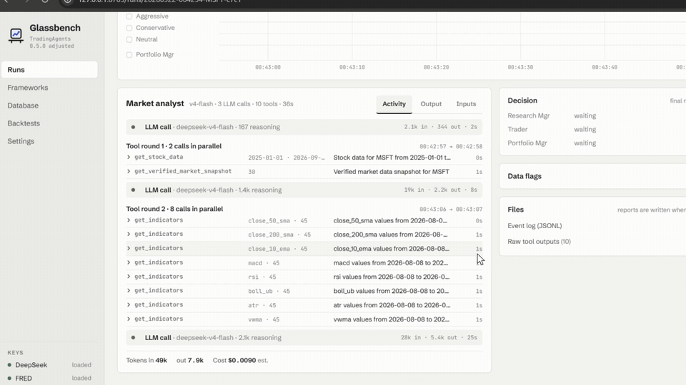
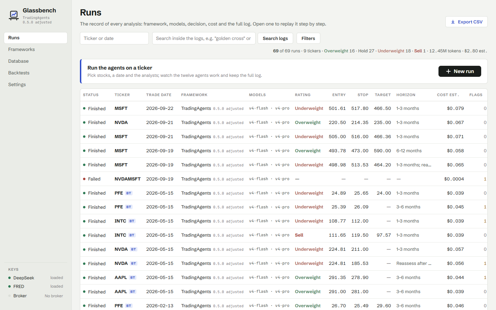
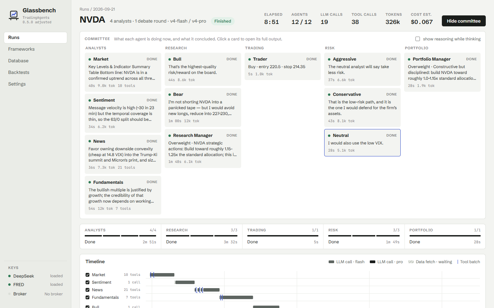
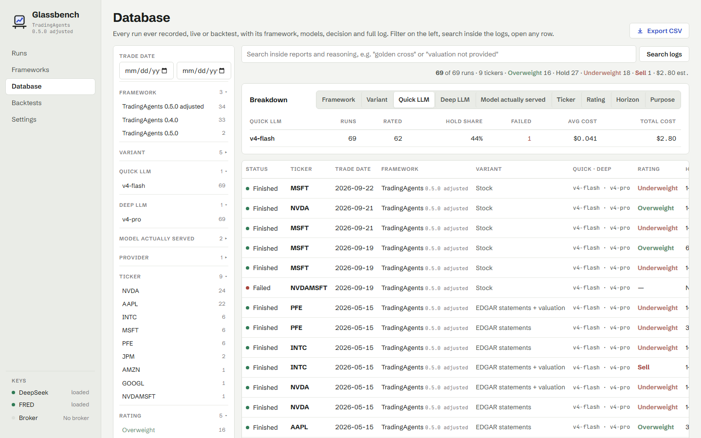
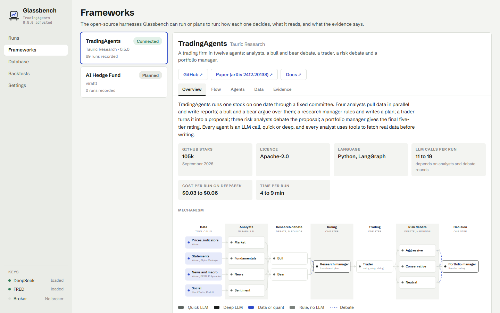
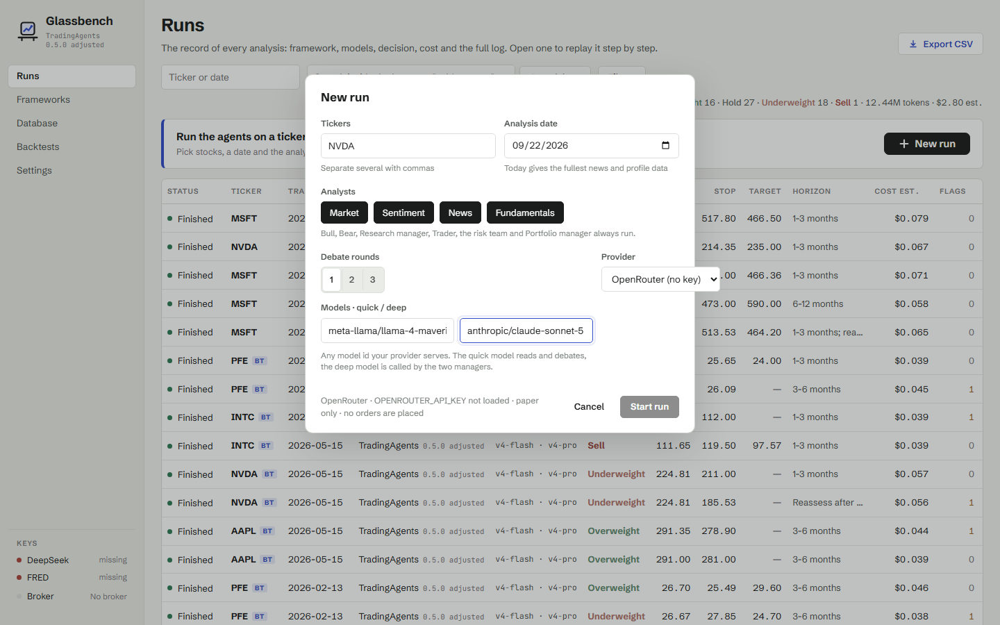
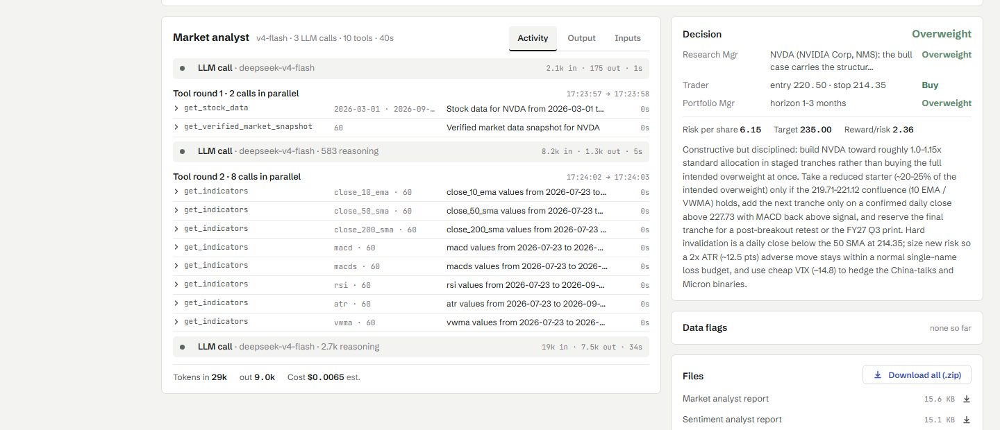
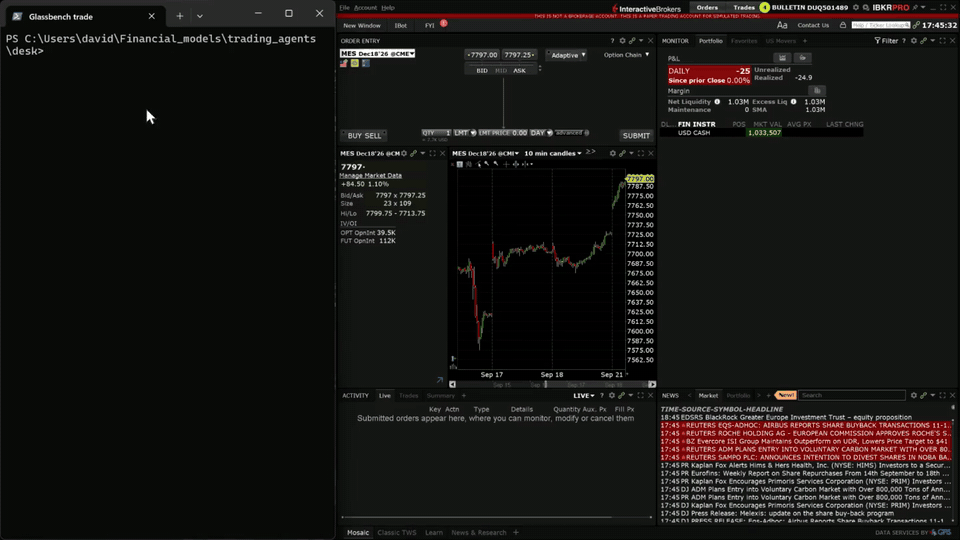

<p align="center">
  <a href="https://davidariasfinance.com/glassbench/"></a>
</p>

<p align="center">
  <a href="https://davidariasfinance.com/glassbench/"></a>
  <a href="https://youtu.be/Bvucb9BpJ1U"></a>
  <a href="https://github.com/TauricResearch/TradingAgents"></a>
  <a href="https://arxiv.org/abs/2412.20138"></a>
  <a href="LICENSE"></a>
  
  
</p>

## What it is

Glassbench is a UI and local workbench for TradingAgents and other LLM trading frameworks. Today it runs the official [TradingAgents](https://github.com/TauricResearch/TradingAgents) engine (v0.5.0, unmodified) and records what its twelve agents read, argued and decided, so you can judge the method yourself instead of trusting a rating.

For people curious about AI trading agents but unconvinced: every run is recorded, every flag is shown, every cost is counted.

- **Live run and replay.** Twelve agents in five stages (analysts, research debate, trader, risk committee, portfolio manager), one card per agent with what it is doing right now and what it concluded, the DeepSeek reasoning stream if you want it, and a timeline of every LLM and tool call.
- **A database of every run.** Framework and version, models, ticker, date, rating, entry, stop, target, horizon, tokens, cost, flags. Filter by any of them, full-text search inside the logs, export to CSV. This repository ships the author's database as a courtesy: [68 runs](#the-runs-database) on 8 tickers.
- **Frameworks page.** A reference sheet per framework: how it decides, what it reads, what the evidence says, with an SVG of the mechanism.
- **Backtests with an honest simulator.** Weekly grids, next-open fills, trading costs, buy-and-hold and moving-average baselines, a shuffled-rating placebo, and side-by-side variants of the same decisions.
- **A trade at the broker.** `trade.py` turns a finished run into one bracket order on an Interactive Brokers paper account, with the trader's stop and the portfolio manager's target attached, and links the order back to the run that produced it.

Nothing here is a ready system to trade with. See [Honest limits](#honest-limits).

<p align="center">
  
</p>

> **Disclaimer.** Glassbench is for research and education. It places orders only on paper accounts, it does not give investment advice, and nothing in the repository or its database is a recommendation to buy or sell anything. The agents are wrong often, and the runs shipped here show it.

---

## Highlights

**The committee, live.** One card per agent, grouped by stage, with what it is reading, what it is writing and its one-line conclusion. Click a card for the full output: every LLM call, every tool call with its result, the reasoning stream. A stage strip shows where the run is, and a timeline shows who ran when and for how long. Every run can be replayed step by step afterwards.

**A database of every run, not a log folder.** Each run lands in SQLite with its framework and version, provider and models, ticker, date, analysts, debate depth, rating, entry, stop, target, horizon, tokens, tool calls, cost and flags. The Runs page filters on all of it; the Database page facets it (framework version, variant, quick and deep model, the model actually served, ticker, rating, horizon, purpose) and searches the full text of every report and every reasoning trace. Export any view to CSV.

**Benchmark LLMs on the same harness.** The framework is fixed; the models are yours to choose. Pick the provider and type any model id for the quick role (reads and debates) and the deep role (the two managers decide). DeepSeek is the default; OpenAI, Anthropic, Google, xAI, Qwen, GLM, MiniMax, Mistral, Kimi, Groq, OpenRouter and a local Ollama are one key away. Every run records which model was asked for and which was actually served, so two models on the same stock and date sit side by side in the same table with their cost.

**Choose the agents.** One to four analysts, one to five debate rounds, and named variants that change how the agents are fed (prompt wording, SEC EDGAR statements as filed, point-in-time valuation) without touching the engine. Matched pairs of variants on the same cells are compared by reading what the agents wrote, not just by their ratings ([the valuation matched pair](docs/evaluation-valuation-pair.md)).

**Backtest honestly.** Weekly grids of runs with a budget cap, replayed against buy-and-hold, a moving-average rule and a shuffled-rating placebo, with next-open fills and trading costs ([the method](docs/backtest-method.md)).

**Then trade it, on paper.** `trade.py` sends the decision to an Interactive Brokers paper account as one bracket order, and the order stays linked to the run that produced it.

## Screenshots

| Runs, the record of every analysis | A run, with the committee board |
|---|---|
|  |  |

| Database, faceted over every run | Frameworks, the reference sheet |
|---|---|
|  |  |

| New run: any provider, any model id, your choice of agents | An agent opened: its calls, tools and output |
|---|---|
|  |  |

| A paper trade: the committee's decision becomes a bracket order at Interactive Brokers, target and stop attached |
|---|
|  |

## Frameworks

| Framework | Status | Notes |
|---|---|---|
| [TradingAgents](https://github.com/TauricResearch/TradingAgents) 0.5.0 | Connected | The engine runs untouched. Glassbench observes it through LangChain callbacks and reads its state; every node name and state key it depends on lives in one file, `backend/deskapp/adapter.py`, with tests. Optional variants (prompt wording, SEC EDGAR point-in-time valuation) are applied at runtime and never change the clone. |
| [AI Hedge Fund](https://github.com/virattt/ai-hedge-fund) | Planned | Reference sheet on the Frameworks page (how it decides, links to its vision and roadmap). The adapter is the next framework on the list, so that two frameworks can be compared on the same stock and date. |

The Framework column in every table shows the harness and version only (`TradingAgents 0.5.0`). A build that contains changes on top of the release is labelled `adjusted`, with the changes listed in the tooltip.

## Quick start

You need Python 3.11 or newer, Node 22 or newer, Git, and an API key for one LLM provider. DeepSeek is the default and costs about $0.06 per full run; twelve other providers and local Ollama are listed in `.env.example`.

**1. Clone Glassbench and the engine.**

```powershell
git clone https://github.com/davidalmeida90/glassbench.git
cd glassbench
git clone --branch v0.5.0 --depth 1 https://github.com/TauricResearch/TradingAgents.git
```

The engine is expected at `./TradingAgents` (or a sibling `../TradingAgents`, or wherever `GLASSBENCH_ENGINE_DIR` points).

**2. Python environment.**

```powershell
py -3.11 -m venv .venv            # Mac or Linux: python3 -m venv .venv
.\.venv\Scripts\Activate.ps1      #                source .venv/bin/activate
pip install -r requirements.txt
pip install -e .\TradingAgents
```

**3. Keys.** Copy `.env.example` to `.env` and paste your key after the equals sign (`DEEPSEEK_API_KEY`, or the variable of the provider you will pick). Only the names listed there are read, and values never reach the browser.

**4. Start.**

```powershell
.\glassbench.ps1                  # Mac or Linux: ./glassbench.sh
```

The first start builds the frontend, then the app is at http://127.0.0.1:8765. Press **New run**, pick a ticker, a date, the analysts, the provider and the two models, and watch the committee work. A full four-analyst run takes about eight minutes and costs about six cents on DeepSeek.

**Headless, without the browser:**

```powershell
cd backend
python -m deskapp run NVDA --analysts market,news,fundamentals
```

## The runs database

`data/desk.db` is SQLite, and this repository ships the author's own database as a courtesy: 68 runs on 8 tickers (NVDA, AAPL, MSFT, INTC, PFE, JPM, AMZN, GOOGL), September 2026, on TradingAgents 0.4.0 and 0.5.0 with DeepSeek V4 Flash as the quick model and V4 Pro as the deep model. It includes the two Microsoft runs from the video that disagree on the same day, the NVIDIA run that became a paper order, a weekly backtest pilot, and matched pairs of variants. Each run's reports, tool outputs and final state are under `data/runs/<run_id>/`.

```sql
-- ratings by ticker
SELECT ticker, rating, COUNT(*) FROM runs WHERE status = 'finished' GROUP BY 1, 2 ORDER BY 1;

-- what the portfolio manager wrote, full text search
SELECT run_id, agent, snippet(event_text, 4, '[', ']', '...', 12) FROM event_text WHERE event_text MATCH 'valuation' LIMIT 20;
```

The Runs and Database pages export any filtered view to CSV. Every finished run stays in the database, by design: the disagreements are the point.

| Where | What |
|---|---|
| `data/desk.db` | the runs table, every event, and a full-text index of the logs |
| `data/runs/<run_id>/reports/` | analyst reports, both debates, trader proposal, risk debate, final decision |
| `data/runs/<run_id>/tool_outputs/` | the full output of every tool call the agents made |
| `data/runs/<run_id>/state.json` | the final state of the graph |
| `data/orders.jsonl` | paper orders sent by `trade.py`, each linked to its run |
| `state/trading_memory.md` | the engine's decision memory (created on first run) |

## Data and keys

| Source | Used for | Key |
|---|---|---|
| DeepSeek (default), OpenAI, Anthropic, Google, xAI, Qwen, GLM, MiniMax, Mistral, Kimi, Groq, OpenRouter, or a local Ollama | the agents, chosen per run | that provider's key in `.env` (`DEEPSEEK_API_KEY`, `OPENAI_API_KEY`, ...); Ollama needs none |
| Yahoo Finance | prices, indicators, news | none |
| SEC EDGAR | statements as filed, and the point-in-time valuation variant | `SEC_EDGAR_EMAIL` (the SEC asks callers to identify themselves) |
| FRED | macro series | `FRED_API_KEY`, free |
| StockTwits, Reddit | the sentiment analyst | none |
| Interactive Brokers, Alpaca | paper orders and connection checks | TWS or IB Gateway logged into a paper account; `ALPACA_API_KEY` and `ALPACA_SECRET_KEY` for Alpaca paper |

Everything the engine downloads goes into `state/cache/`. Keys are read once, from `.env`, by the backend process; the browser gets their names and lengths, never their values.

## A trade at the broker

```powershell
py -3 trade.py NVDA MSFT              # run the twelve agents on each stock, then trade
py -3 trade.py NVDA MSFT --reuse      # replay each stock's latest finished run, then trade
py -3 trade.py NVDA --dry-run         # everything except sending the orders
```

Long only, one decision, fixed size: Buy or Overweight becomes one marketable limit order for $10,000 worth with the trader's stop and the portfolio manager's target attached as a bracket; Hold does nothing; Underweight or Sell closes what is held. Paper ports and paper accounts only, one working order per stock, size capped, and a y/N confirmation before anything is sent. It needs Glassbench running and Trader Workstation or IB Gateway logged into a paper account.

## What a run records

Twelve agents: four data analysts (market, sentiment, news, fundamentals) with tools, a bull and a bear researcher, a research manager, a trader, three risk debaters and a portfolio manager. Cheap fast models do the reading and the debating; the expensive model is called only by the two managers. Every tool returns data dated on or before the run date, which is what makes a backtest possible.

The full mechanism, agent by agent, with the tool calls from a real run: [docs/how-a-run-works.md](docs/how-a-run-works.md). The backtest method and the pilot: [docs/backtest-method.md](docs/backtest-method.md). What serving point-in-time valuation changes in what the agents write, measured on 24 runs: [docs/evaluation-valuation-pair.md](docs/evaluation-valuation-pair.md). Notes on how to evaluate these systems, and which published results hold up: [docs/backtest-research.md](docs/backtest-research.md).

## Honest limits

- The TradingAgents paper reports one backtest on three stocks over three months (January to March 2024). An independent test over longer windows landed below buy-and-hold. A Sharpe of 8 over one quarter says the idea deserves a test, not that it works.
- Two runs on the same ticker and date can differ. The database holds twin runs two minutes apart with opposite ratings. Measure how often that happens before trusting any single rating.
- The backtest pilot in this repository (AAPL and NVDA, weekly, 2025 to 2026) had the agents' trader levels lose money while buy-and-hold gained, and the ratings alone never traded. Trading costs, next-open fills and a shuffled-rating placebo are in the simulator so the comparison stays fair.
- The order in the video was sent to a paper account. No real money moved. Nothing in this repository is investment advice.

## Layout

```
glassbench/
├── glassbench.ps1, glassbench.sh   launchers (build the frontend once, then serve)
├── trade.py                        one bracket order per stock at an IB paper account
├── backend/deskapp/
│   ├── adapter.py      every TradingAgents node name, state key and parser (the one file to fix after an engine update)
│   ├── capture.py      LangChain callbacks and engine warnings turned into events
│   ├── runner.py       runs the graph with streaming, memory and reports
│   ├── runconfig.py    one engine config per run (the engine keeps a process-wide one)
│   ├── variants.py     runtime variants: prompt wording, SEC EDGAR statements and valuation
│   ├── edgar.py        point-in-time fundamentals from SEC EDGAR
│   ├── backtest.py     weekly grids of runs with a budget cap
│   ├── simulate.py     the simulator: fills, costs, baselines, placebo
│   ├── paired.py       matched-pair reading of what agents wrote
│   ├── brokers.py      Alpaca and Interactive Brokers paper connection checks
│   ├── frameworks.py   the reference sheets on the Frameworks page
│   ├── store.py        SQLite, events, full-text index
│   ├── api.py          REST and Server-Sent Events (replay, then live)
│   └── settings.py     paths, models, price table, engine config
├── backend/tests/      adapter, backtest, simulator, variants, run config
├── frontend/src/       React and TypeScript (Vite)
├── data/               the runs database and the run files
└── docs/               how a run works, backtest method, the valuation matched pair, research notes, screenshots
```

After updating the engine, run the adapter tests; a failing test names what changed upstream, and `adapter.py` is where to fix it:

```powershell
cd backend
python -m unittest discover tests
```

## Development

```powershell
cd frontend && npm run dev        # Vite on http://127.0.0.1:5173, /api proxied to the backend on 8765
cd backend && python -m unittest discover tests
```

Engine internals live in one place, `backend/deskapp/adapter.py`; `capture.py` turns LangChain callbacks into numbered events; `store.py` keeps them in SQLite with a full-text index; `api.py` replays them over Server-Sent Events and then switches to live. Anything that changes how the agents think is a named variant in `variants.py`, applied per run through `runconfig.py`, so the engine clone is never edited.

## Roadmap

- **Second framework.** An adapter for AI Hedge Fund, so two frameworks run on the same stock and date and land in the same table.
- **Transparency pack.** A grounding check of each report against the data it pulled, rerun dispersion (how often twin runs disagree), and a compare view.
- **Scheduled sessions.** A watchlist run on a clock, with rules that turn ratings into orders only when several runs agree.
- **More brokers and guardrails.** Alpaca paper orders next to Interactive Brokers, a kill switch, a cost budget.

## Contributing

Issues and pull requests are welcome, in particular a second framework adapter, more brokers, and evaluation methods. Keep engines untouched: anything Glassbench needs from a framework goes through its adapter, and anything that changes how agents think is a named variant applied at runtime.

## Credits and license

Glassbench is by [David Arias, CFA](https://davidariasfinance.com), released under the [Apache License 2.0](LICENSE). It runs on top of [TradingAgents](https://github.com/TauricResearch/TradingAgents) by Tauric Research (Apache 2.0), which is not bundled here; see the [paper](https://arxiv.org/abs/2412.20138) by Yijia Xiao, Edward Sun, Di Luo and Wei Wang. The video that walks through all of this: [Open Source AI Trading Agents on DeepSeek: Setup to a Broker Order](https://youtu.be/Bvucb9BpJ1U).

## Citation

If you use the runs database or the simulator in research, cite the TradingAgents paper and link this repository:

```bibtex
@misc{xiao2025tradingagents,
  title  = {TradingAgents: Multi-Agents LLM Financial Trading Framework},
  author = {Yijia Xiao and Edward Sun and Di Luo and Wei Wang},
  year   = {2025},
  eprint = {2412.20138},
  archivePrefix = {arXiv},
  url    = {https://arxiv.org/abs/2412.20138}
}
```
